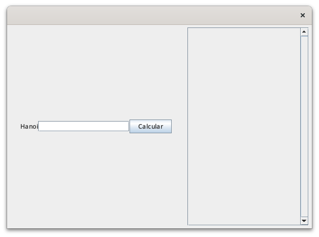
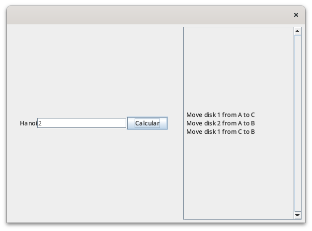
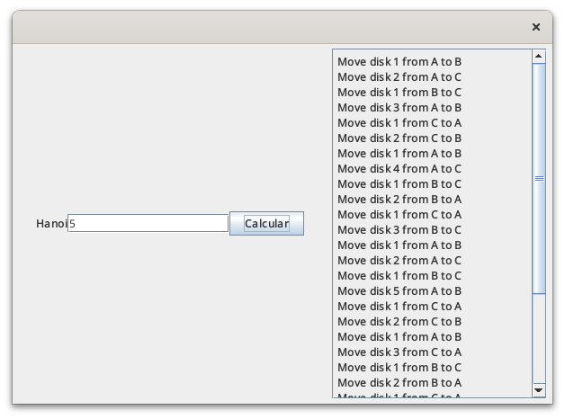
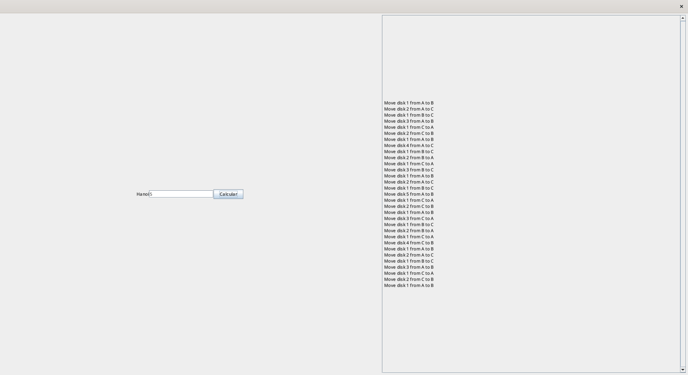

# TSU Desarrollo de Software Multiplataforma
# Daniel Ivan Escobar Vasquez
# Ruth Martinez Dominguez
# Estructura de Datos - 4F
# 15 de Septiembre del 2024

\pagebreak

# Contenido
1. [Creando la clase Hanoi para resolver el juego](#creando-la-clase-hanoi-para-resolver-el-juego)
2. [Creando la entrada a la aplicación](#creando-la-entrada-a-la-aplicación)
3. [Mejorando la interfaz](#mejorando-la-interfaz)
4. [Capturas del programa](#capturas-del-programa)
5. [Repositorio](#repositorio)


## Creando la clase Hanoi para resolver el juego

Para implementar la solución de las Torres de Hanoi crearemos un metodo que tome 4 parametros:
- n representa el numero de discos.
- `from_pole` representa el tubo de donde tomaremos un disco
- `to_pole` representa el tubo donde soltaremos un disco
- `aux_pole` representa el tubo que usaremos cuando necesitemos mover temporalmente un disco.

Lo primero que hace el metodo es verificar que n no se 0, pues en caso de serlo tendremos un return temprano.

En cualquier otro caso, entraremos a un recursión a la que le pasaremos como dato n - 1, que represent el disco siguiente, `from_pole` que queda igual, per en cambio aux_pole se pasa como segundo argumento y to_pole como tercero.

Al salir de la función, concatenamos un texto que de la instruccion con el disco actual, y posteriormente volvemos a correr play, y concatenamos con el texto. Finalmente, devolvemos el texto.

```java
package com.mycompany.app;

public class Hanoi {
    public static String play(int n, char from_pole, char to_pole, char aux_pole){
        String text = "";
        if(n != 0){
            text = text + play(n - 1, from_pole, aux_pole, to_pole);
            text = text + "Move disk " + n + " from " + from_pole + " to " + to_pole + "<br>";
            text = text + play(n - 1, aux_pole, to_pole, from_pole);
        }
        return text;
    }    
}
```

## Creando la entrada a la aplicación

Creamos la clase principal de nuestra aplicación. En ella ejecutamos el metodo RenderUI de la clase View. Instanciamos la clase Hanoi y la usamos como parametro dentro del metodo createSingleInputView de la clase View.

```java
package com.mycompany.app;

public class App {
    public static void main(String[] args) {
        View.RenderUi();
        Hanoi hanoi = new Hanoi();
        View.createSingleInputView(hanoi);
    }
}

```

## Mejorando la interfaz

Anteriormente tuvimos un bug que incrementaba la altura de los componentes, para resolverlo cambiaremos la manera en la que renderizamos los componentes:

Crearemos un nuevo panel que contendrá nuestra `JLabel` de respuestas, y ese panel a su vez se lo pasaremos a `JScrollPane` lo que permite que podamos bajar o subir segun sea necesario.

```java
        // Create growing panel for answer
        JPanel answerGrowingPanel = new JPanel();
        answerGrowingPanel.setLayout(new GridBagLayout());
        
        gbc.gridx = 1; gbc.gridy = 0;
        gbc.fill = GridBagConstraints.BOTH;
        gbc.weightx = 1.0;
        gbc.weighty = 1.0;
        answerGrowingPanel.add(answer, gbc);
        
        JScrollPane scrollPane = new JScrollPane(answerGrowingPanel);
        scrollPane.setVerticalScrollBarPolicy(ScrollPaneConstants.VERTICAL_SCROLLBAR_ALWAYS);
```

Con estas modificaciones logramos que nuestro programa funcione de manera adecuada.

# Capturas del programa







## Repositorio

[Repositorio en Github](https://github.com/MindSetFPS/practica-6)
